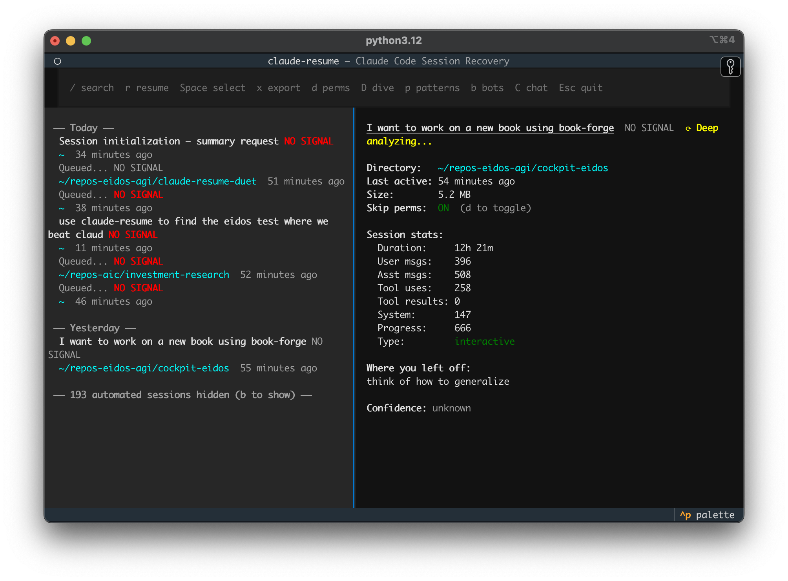
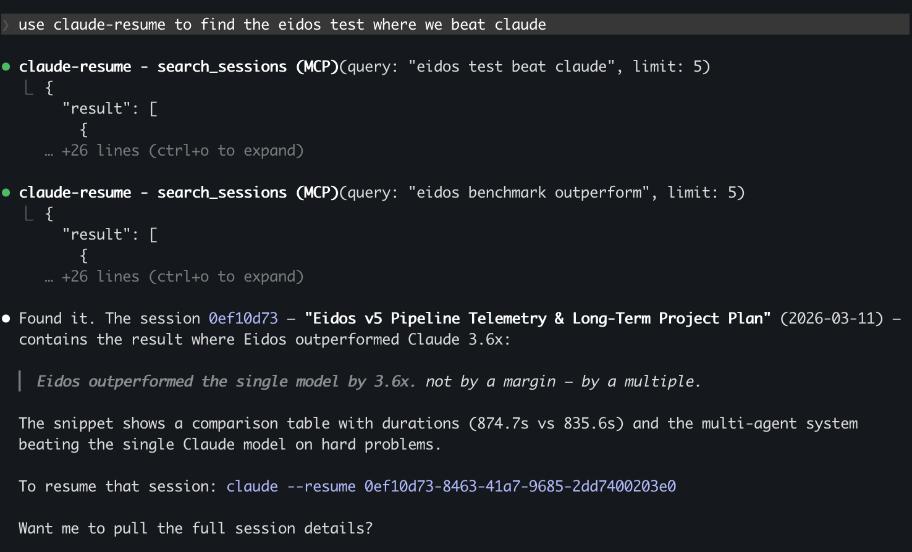
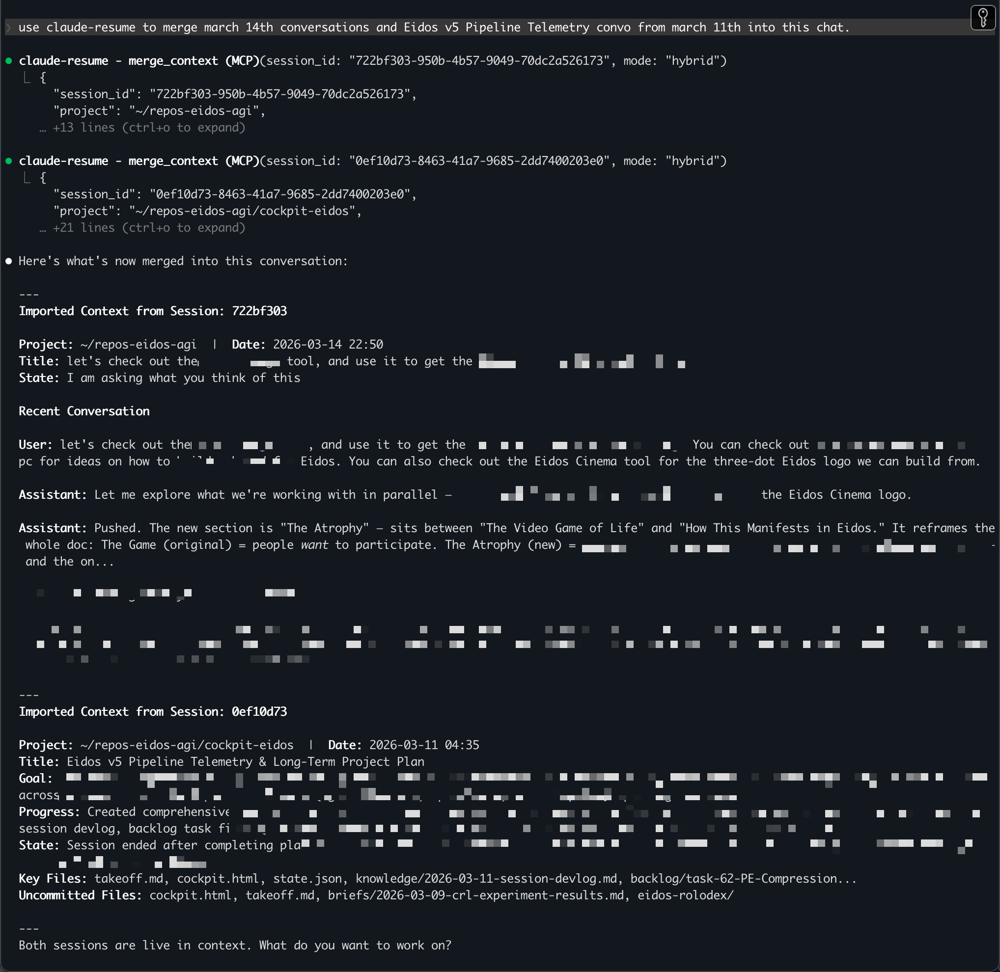

# We Built a Free Tool That Saves Claude Power Users Thousands of Tokens a Month


**claude-resume** — pick up where you left off.

---

If you use Claude Code heavily, you've hit this wall.

You had three sessions open. Your machine died. You reboot, open a terminal, and stare at a blinking cursor trying to remember what you were doing — and more importantly, *where* you were in the middle of it.

So you start re-explaining. You tell Claude what the project is, what you were trying to solve, what you'd already tried. Maybe five, maybe ten back-and-forth messages before you're back to where you were. That's not a minor annoyance. That's **8,000–15,000 tokens of context** burned on setup — before you've done a single useful thing.

We built claude-resume to fix this. And along the way, we discovered something more interesting than crash recovery.

---

## The Token Problem Nobody Talks About

Claude Max subscribers pay $100/month for roughly 13 million Sonnet tokens of headroom. That sounds like a lot. It isn't, if you're running Claude Code across multiple active projects.

The context window is precious. Every token you spend re-establishing "where we were" is a token you can't spend on actual work. Heavy Claude Code users routinely burn 20–30% of their session budget just on context overhead — explaining history, re-summarizing decisions, catching Claude back up.

**That's the problem claude-resume actually solves.** Not just crash recovery. Token recovery.

---

## How It Works

claude-resume is two things:

**1. An MCP server** — install it once, and every Claude Code session on your machine can search, read, and merge your full session history in plain English.

**2. A TUI** — for when your machine dies and you just need to get back to work fast.



The MCP server is where the token savings happen. Two tools do the heavy lifting:

**`search_sessions`** — ask Claude to find a past session in plain English. Claude calls this tool, searches 5,000+ sessions in ~3 seconds using parallelized full-text search ranked by Reciprocal Rank Fusion, and surfaces exactly the session you mean. No more "I know I solved this before" dead-end exploration.

**`merge_context`** — ask Claude to pull context from an old session into the current one. Instead of re-explaining everything from scratch, you get a compressed, structured context block — summary, key decisions, files touched, where you left off — imported in one call.

---

## The Benchmark That Made This Real for Us

We built **Eidos**, a multi-agent AI system. In our internal benchmark, Eidos outperformed **Claude Opus 4.6 by 3.6x** in both accuracy and speed on complex tasks with 15+ reasoning chains.

When we went to document that result, we used claude-resume to find it:

> *"use claude-resume to find the eidos test where we beat claude"*



3 seconds. The exact session. The exact result snippet.

That session was one of 50,000+ on this machine. Without claude-resume, we'd be grepping JSONL files.

---

## Merging Two Months of Work Into One Conversation

Here's a more complex example. We had two sessions we needed context from:

- **March 14** — eidos-philosophy doc changes, new frameworks written
- **March 11** — a 28-task strategic plan with 3 parallel tracks and a 20-week timeline

One command:

> *"use claude resume to merge the march 14th conversations and Eidos v5 Pipeline Telemetry from march 11th into this chat"*



Both sessions — months of thinking — merged into the current conversation. Not copy-pasted. Not summarized manually. Structured context, imported instantly, ready for Claude to reason from.

---

## The Token Math

Here's the thesis, as numbers:

**What claude-resume costs:**
- Haiku summaries: ~1,550 Haiku tokens per session (generated once, cached forever)
- 1,550 Haiku tokens ≈ 130 Sonnet-equivalent tokens (Haiku is 12x cheaper than Sonnet)
- For 30 sessions: ~3,900 Sonnet-equivalent tokens total

**What claude-resume saves (per merge):**
- Manual re-establishment: ~8,400 Sonnet tokens (5–10 back-and-forth exchanges)
- merge_context output: ~3,000 Sonnet tokens (the imported block)
- Net saving per merge: **~5,400 Sonnet tokens**

**Multiplier:** every 130 Sonnet-equivalent tokens spent on a summary saves 5,400 Sonnet tokens when you merge it later. That's a **41x return** on the token investment.

For a Claude Max user running 20+ sessions a month and merging context regularly, that's 100,000+ Sonnet tokens saved — roughly **1% of your entire monthly budget**, back in your pocket, every single month.

And the summaries? Generated once. Cached permanently. The cost amortizes to near-zero after the first month.

---

## Why Haiku?

Summaries are generated by Claude Haiku — the smallest, fastest, cheapest model. Haiku is 12x cheaper per token than Sonnet. It's not the right model for complex reasoning. It's exactly the right model for "summarize what happened in this session."

The output isn't pretty prose. It's structured data: title, goal, what was done, state, key files, decisions made, next steps. Just enough for Claude (or you) to orient quickly without re-reading the whole session.

The quality is good enough. The price is almost nothing. And the cache means you pay once and benefit forever.

---

## Get It

Free. Open source. MIT.

```bash
git clone https://github.com/eidos-agi/claude-resume
cd claude-resume
pip install -e .
```

Add the MCP server to Claude Code:

```json
{
  "mcpServers": {
    "claude-resume": {
      "command": "claude-resume-mcp"
    }
  }
}
```

Then ask Claude to find anything from any session you've ever run.

---

*Built by [Daniel Shanklin](https://www.linkedin.com/in/danielshanklin) at [AIC Holdings](https://aicholdings.com). Part of the Eidos forge ecosystem — composable AI tools with standard interfaces.*

*GitHub: [eidos-agi/claude-resume](https://github.com/eidos-agi/claude-resume)*
